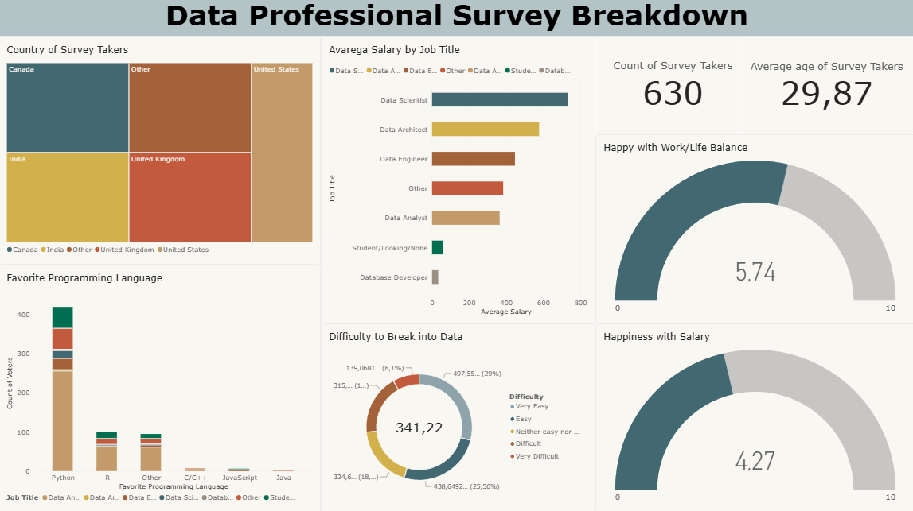

# Data Professional Survey Breakdown – Power BI Dashboard

Ez a portfólió projektem a **Data Professional Survey** adathalmaz feldolgozását, tisztítását és vizualizációját mutatja be Microsoft Power BI segítségével. A célom az volt, hogy átfogó képet kapjak az adatszakmában dolgozók fizetési tendenciáiról, munka-magánélet egyensúlyáról, kedvenc programozási nyelveiről, valamint a pályakezdés nehézségeiről.

---

## 📊 Dashboard Áttekintés

---

## 🛠️ Adatelőkészítés és Tisztítás (Data Cleaning & ETL)

A Power Query segítségével végeztem el az adatok transzformációját a nyers felmérési fájlból az alábbi lépések szerint:

1. **Felesleges oszlopok eltávolítása:**  
   Kiszűrtem a felmérés technikai és redundáns mezőit (pl. egyedi azonosítók, időbélyegek, belső technikai oszlopok), hogy átlátható, tiszta táblamodellt hozzak létre.
2. **Kategóriák standardizálása és tisztítása:**  
   A kérdőívben több olyan kérdés szerepelt, ahol a válaszadók szabad szövegesen adhattak meg egyedi opciókat (pl. szerepköröknél, országoknál, nyelveknél). Az elemzés egységessége és a túlzott szegmentáció elkerülése érdekében ezeket az egyedi szöveges bejegyzéseket egységesen egyetlen **"Other"** kategóriává vontam össze.
3. **Numerikus típuskonverziók és átlagok:**  
   Beállítottam a megfelelő adattípusokat (életkor, elégedettségi pontszámok 1-10 skálán, fizetési sávok), amelyek alapot adtak a DAX aggregációknak és metrikáknak.

---

## 📈 Fő vizualizációk és KPI-k

A dashboard az alábbi részegységekre és kimutatásokra épül:

- **Fő KPI Kártyák:**
  - **Count of Survey Takers:** Összesen **630** felmérést kitöltő szakember.
  - **Average Age of Survey Takers:** Az átlagéletkor **29,87 év**.
- **Country of Survey Takers (Treemap):**  
  A válaszadók földrajzi eloszlását mutatja be, kiemelve a legfőbb piacokat (Kanada, Egyesült Államok, India, Egyesült Királyság és az Egyéb kategória).
- **Average Salary by Job Title (Bar Chart):**  
  Fizetések összehasonlítása szerepkörök szerint. A mintában a **Data Scientist** és a **Data Architect** pozíciók mutatják a legmagasabb átlagot, míg a belépő/tanuló kategóriák az alsó sávban helyezkednek el.
- **Favorite Programming Language (Stacked Column Chart):**  
  A preferált nyelvek eloszlása a munkakörök bontásában. A **Python** toronymagasan vezeti a népszerűségi listát, ezt követi az **R**, illetve a ritkábban említett nyelvek (C/C++, JavaScript, Java).
- **Difficulty to Break into Data (Donut Chart):**  
  Megmutatja, mennyire találták nehéznek a válaszadók a szektorba való belépést (Very Easy-től Very Difficult-ig).
- **Elégedettségi Gauge diagramok (0–10 skála):**
  - **Happy with Work/Life Balance:** Átlagosan **5,74 / 10** – mérsékelt elégedettség a munka-magánélet terén.
  - **Happiness with Salary:** Átlagosan **4,27 / 10** – a fizetéssel való elégedettség észrevehetően alacsonyabb, mint a munka-magánélet egyensúlyé.

---

## 💡 Főbb Megállapítások (Key Insights)

- **Python dominancia:** A szakemberek túlnyomó többsége a Pythont tekinti elsődleges programozási nyelvének minden nagyobb pozícióban.
- **Fiatal szakmai bázis:** A 30 év alatti átlagéletkor jelzi, hogy az iparág rengeteg pályakezdőt és karrierváltót vonz.
- **Fizetési elégedetlenség:** A 4,27-es fizetési elégedettségi mutató rávilágít, hogy a magasabb elvárt bérek és a valós kompenzáció között érzékelhető különbség van a kitöltők körében.

---

## 📁 Fájlok a repository-ban

- `Power BI - Final Project.xlsx` – A kiindulási, feldolgozott adathalmaz.
- `Data Professional Survey Breakdown.pbix` – A Power BI projektfájl interaktív vizualizációkkal és beépített adatmodellel.
- `power_bi_project.png` – A kész dashboard képernyőképe.